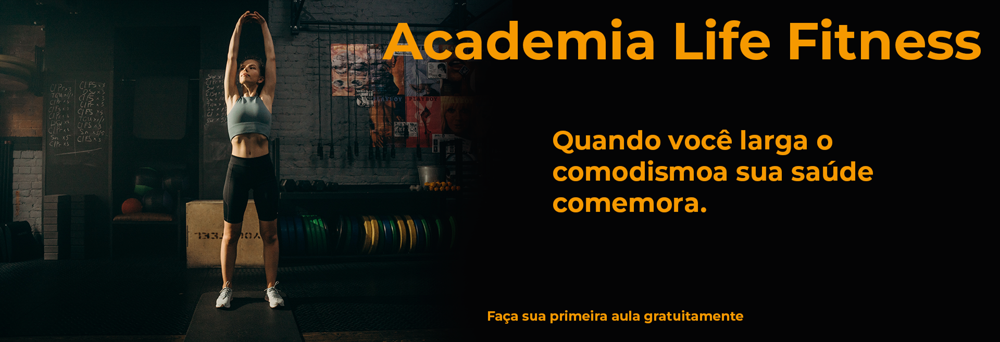

  
    

# Life Fitness

## <a href="https://teodoro10.github.io/Life-Fitness/" target="_blank"> Veja o projeto </a>

## <a href="[/img/capa.png](https://www.figma.com/design/5cqN3xy84GWkmoaLpewtB0/Life-Fitness?node-id=0-1&t=yd5MJIh2EqfKgryO-1)" target="_blank"> Prototipofigma </a>

_Fundadores do Projeto:_

### Felipe Teodoro

<a href="https://github.com/Teodoro10/" target="_blank">GitHub</a>

<a href="https://www.linkedin.com/in/felipe-teodoro10/" target="_blank">Linkedin</a>

### Vinicius Feitosan

<a href="https://github.com/Feitosan" target="_blank">GitHub</a>

<a href="https://www.linkedin.com/in/vinicius-feitosan/" target="_blank">Linkedin</a>

### Gustavo Sirineu

<a href="https://www.linkedin.com/in/sirineuu/" target="_blank">Linkedin</a>

<a href="https://github.com/Sirineuu" target="_blank">GitHub</a>

O que mudar nesse prejeto:
0- {
Tela de login {feito}
conectar as telas de login
deixar como primeira
}
1- Home {
Carrosel
Responsividade do site
Botão: Modalidades
Footer
}
2- Modalidades {
Responsividade
Footer
}

3- Contatos {
Botão enviar funcionar
Footer
Responsividade
}
4- Horarios {
Não pode puxar outra aba
Tem que ser no mesmo link
Responsividade
}

5- Fotos{
Responsividade
Footer
}
5- Planos{
Responsividade
Footer
Colocar mais sobre as diferenças dos planos
}
